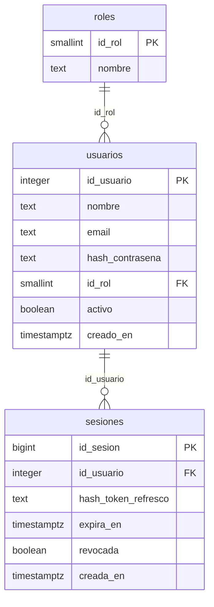
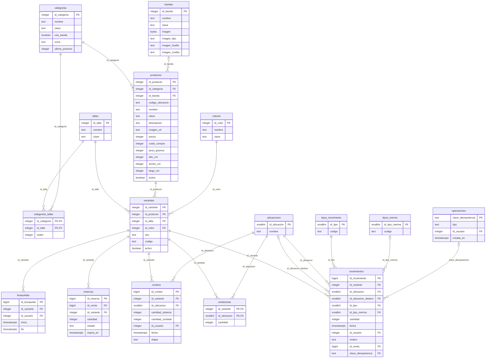
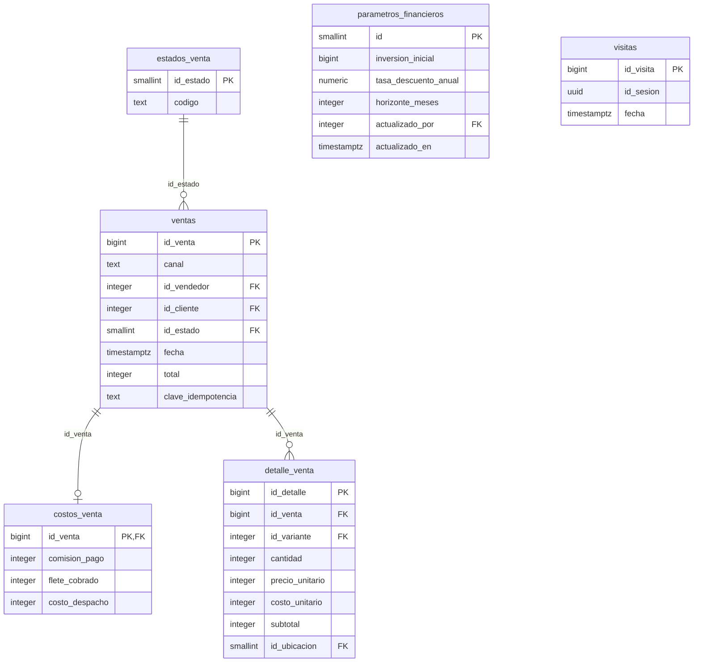
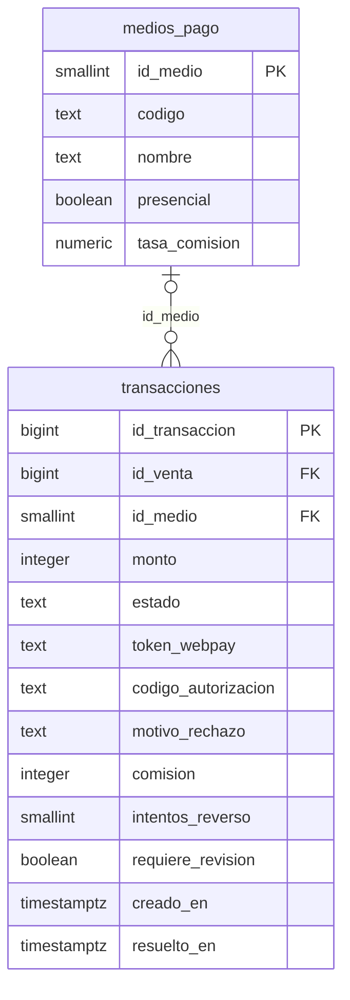
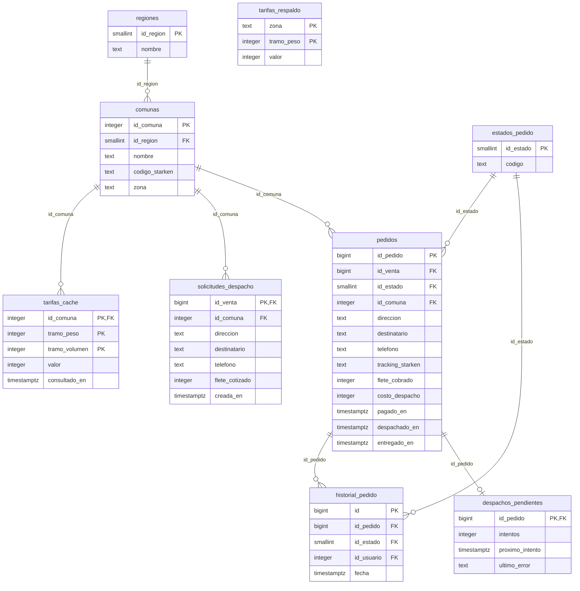
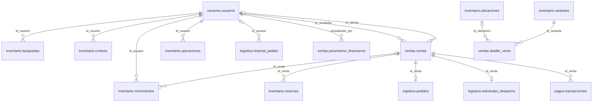

# Modelo de datos

Base de datos PostgreSQL de Rockstar. Una sola instancia con un esquema por dominio, de modo que cada parte del sistema es dueña de sus tablas y las relaciones entre ellas son claves foráneas reales.

| Esquema | De qué es dueño | Tablas |
|---|---|---|
| `usuarios` | Cuentas, roles y sesiones | 3 |
| `inventario` | Catálogo, existencias por ubicación, reservas y movimientos | 16 |
| `ventas` | Ventas del POS y del e-commerce, sus líneas y sus costos | 6 |
| `pagos` | Medios de pago y transacciones | 2 |
| `logistica` | Destinos, pedidos, tarifas y despachos | 9 |

Son 36 tablas, 48 claves foráneas, 52 restricciones `CHECK` y 26 de unicidad.

Los diagramas del final se generan leyendo la estructura de la base, así que coinciden con las tablas reales.

## Cómo se crea y se actualiza

Las tablas se definen en `db/migrations`, en archivos numerados. El backend aplica al arrancar los que falten y anota cada uno en `public.migraciones`, por lo que una base nueva y una ya existente llegan al mismo modelo. Todas las migraciones pendientes corren en una transacción: si una falla, la base queda como estaba.

| Migración | Qué agrega |
|---|---|
| `001_usuarios` | Roles, cuentas y sesiones |
| `002_inventario` | Catálogo, variantes, existencias, reservas, movimientos, conteos y búsquedas |
| `003_ventas` | Estados de venta, ventas y sus líneas |
| `004_logistica` | Regiones, comunas, estados de pedido, pedidos y su historial |
| `005_pagos` | Medios de pago y transacciones |
| `006_ventas_completo` | Ubicación de origen de cada línea, costos de la venta, visitas y parámetros financieros |
| `007_logistica_completo` | Solicitudes de despacho, tarifas guardadas y de respaldo, cola de despachos pendientes |
| `008_comunas` | Las 346 comunas de Chile |
| `009_integridad_ventas` | Claves foráneas de reservas y movimientos hacia la venta |
| `010_imagenes_bandas` | Foto de cada banda, con su tipo, su huella y su crédito |

Una migración ya aplicada no se modifica: un cambio al modelo es siempre un archivo nuevo.

## Qué usa cada módulo

**Punto de venta.** Una venta POS escribe en `ventas.ventas` con canal `POS` y el vendedor, una fila en `ventas.detalle_venta` por prenda con la ubicación de donde salió, y descuenta `inventario.existencias` dejando un movimiento `VENTA`. El cobro queda en `pagos.transacciones` con un medio presencial, y su comisión en `ventas.costos_venta`.

**E-commerce.** El catálogo sale de `inventario.productos` y `variantes`; la disponibilidad es la suma de `existencias` menos las `reservas` vigentes. El checkout crea la venta en estado `PENDIENTE_PAGO`, una reserva por prenda con vencimiento, la `logistica.solicitudes_despacho` con el destino y una transacción `PENDIENTE` con el token de la pasarela. Al confirmarse el pago, la reserva queda firme, la venta pasa a `PAGADA` y la solicitud se convierte en un `logistica.pedidos`. Si el pago falla o vence, la reserva se libera.

**App de bodega.** Usa `inventario` completo y lee los pedidos de `logistica`.

## Reglas que la base hace cumplir

Estas reglas valen aunque el servicio tenga un error, porque están en las tablas:

- La existencia de una prenda en una ubicación nunca es negativa.
- Una venta POS tiene vendedor y una del e-commerce tiene cliente.
- El subtotal de una línea es cantidad por precio unitario. Lo calcula la base y no se puede escribir.
- Una venta no se registra dos veces: su clave de idempotencia es única.
- Una venta genera a lo más un pedido, una solicitud de despacho y una fila de costos.
- No existe una reserva ni un movimiento de una venta inexistente.
- Una venta reserva cada prenda una sola vez.
- Un producto no tiene dos variantes con la misma talla y color, y cada SKU y código es único.
- El token de la pasarela identifica una sola transacción.
- Una transacción está pendiente exactamente mientras no tiene fecha de resolución.
- Todo movimiento de inventario lleva motivo y usuario.
- Los estados, tipos y medios solo admiten los valores de sus tablas de dominio.

## Normalización

El modelo está en tercera forma normal. Estas son las correcciones al modelo base y su motivo:

| Modelo base | Problema | Corrección |
|---|---|---|
| `PRODUCTOS(talla, color, stock, codigo_qr)` | Cada fila mezcla el producto con una de sus variantes; nombre, categoría y precio se repiten por talla y color | `productos` y `variantes`. La variante lleva su SKU y su código |
| `PRODUCTOS.categoria` como texto | Valores repetidos e inconsistentes | Tabla `categorias` y clave foránea. Lo mismo para `bandas`, `tallas` y `colores` |
| `PRODUCTOS.stock` | No distingue ubicación ni reservas | `existencias` por variante y ubicación, y `reservas` aparte |
| `USUARIOS.rol` como texto | Dominio no controlado | Tabla `roles` y clave foránea |
| `VENTAS.id_usuario` | Ambiguo: es el vendedor en el POS y el cliente en el e-commerce | `id_vendedor` e `id_cliente`, con una restricción según el canal |
| `DETALLE_VENTA.id_producto` | No identifica la talla ni el color vendidos | `id_variante` |
| `DETALLE_VENTA.subtotal` | Se deriva de cantidad y precio | Columna generada |
| `PEDIDOS(estado, tracking)` | Faltan destino y costos; estado sin dominio | `estados_pedido`, `comunas` y `regiones`; relación 1 a 1 con la venta |
| `MOVIMIENTOS.id_producto`, `tipo` | No identifica variante ni ubicación; tipo sin dominio | `id_variante`, `id_ubicacion`, `tipos_movimiento` y `tipos_merma` |

### Datos repetidos a propósito

Cada uno es un valor histórico que no debe cambiar cuando cambia su origen, o un saldo que se necesita bloquear:

- `detalle_venta.precio_unitario` y `costo_unitario`: el precio y el costo al momento de vender.
- `ventas.total`: el monto cobrado, con el flete incluido.
- `transacciones.comision`: calculada con la tasa vigente al resolverse el pago.
- `existencias.cantidad`: debe coincidir con la suma de los movimientos. Se guarda para poder bloquear la fila y validar el stock de forma atómica.
- `pedidos.flete_cobrado` y `costos_venta.flete_cobrado`: Logística y Ventas guardan cada una su copia, porque están pensadas como servicios separados.
- Las columnas `clave` de categorías, bandas, tallas, colores y productos: el nombre sin mayúsculas ni tildes, para que "Metallica" y "metállica" no sean dos bandas.

## Diferencias con el diseño original

- **`logistica.solicitudes_despacho`** no estaba en el diseño. Guarda el destino de una compra mientras se paga. Al confirmarse el pago se convierte en pedido y se elimina, de modo que el destino no queda en dos lugares.
- **`inventario.operaciones`** guarda la clave de idempotencia de cada operación. El diseño la ponía única en `movimientos`, pero un ingreso de varias prendas registra varios movimientos con la misma clave.
- **`inventario.categorias`** guarda además si la categoría usa banda, su zona de bodega y la última posición entregada; `categorias_tallas` guarda las tallas que admite.
- **`ventas.visitas`** lleva un identificador de sesión único, que es lo que permite contar una visita una sola vez.
- **`ventas.detalle_venta.id_ubicacion`** registra de qué ubicación salió cada línea de una venta POS.
- **`pagos.medios_pago`** agrega el nombre para mostrar y si el medio es presencial.
- **`pagos.transacciones`** agrega los intentos de reverso y la marca de revisión manual.
- **Un solo usuario de base de datos.** El diseño pedía uno por servicio. Con el backend en un único servicio no aplica todavía.

## Pendiente

- Las tasas de comisión nacen en cero y `tarifas_respaldo` nace vacía: son valores del negocio que define el Gerente.
- `comunas.codigo_starken` está vacío hasta contar con el catálogo de Starken.
- No hay migraciones de reversa. Para volver atrás se restaura un respaldo.

## Respaldo y restauración

```
docker exec rockstar-db-1 pg_dump -U rockstar -d rockstar --no-owner > db/respaldos/rockstar.sql
```

Los respaldos quedan en `db/respaldos`, que no se sube al repositorio porque contiene datos reales.

## Cómo se verifica

```
cd services/api
npm run test:e2e
```

Las pruebas de `test/modelo.e2e.spec.ts` aplican las migraciones sobre un PostgreSQL vacío y comprueban las tablas, los datos de referencia y cada una de las reglas de arriba. También simulan la actualización de una base que ya tenía ventas y pedidos.

## Diagramas

`PK` marca la clave primaria y `FK` una clave foránea.

### usuarios



### inventario



### ventas



### pagos



### logistica



### Relaciones entre esquemas


