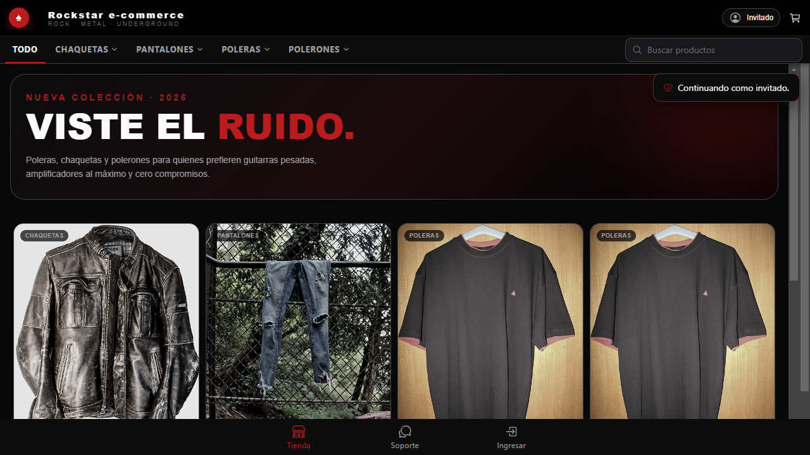
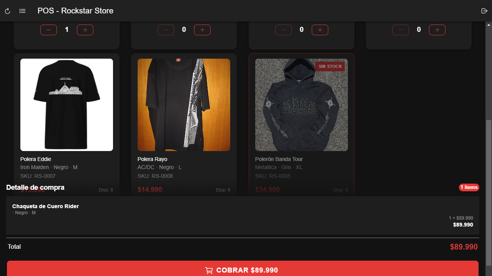
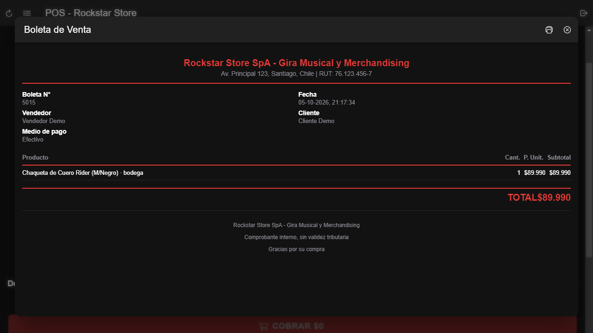
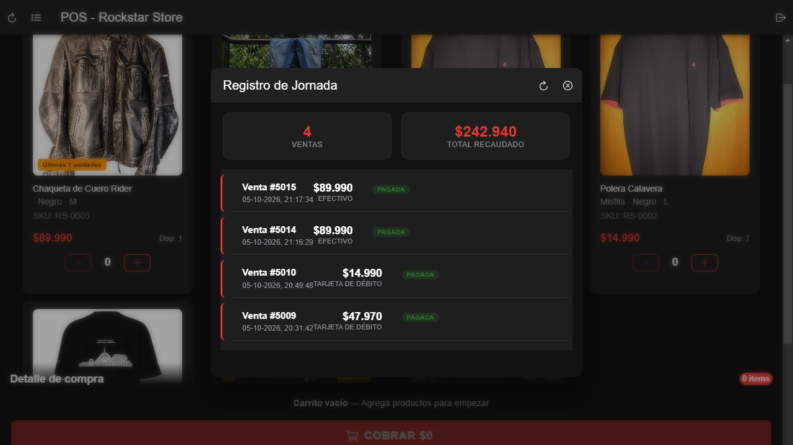
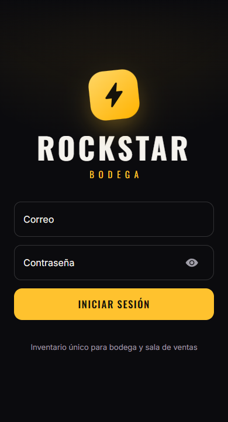
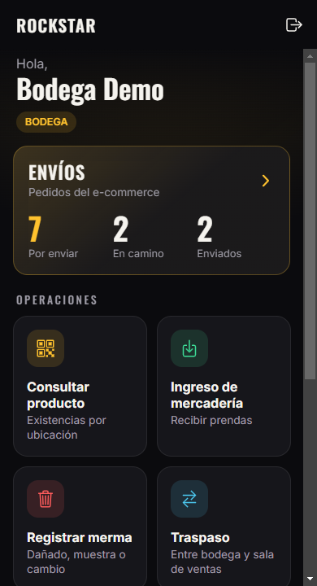
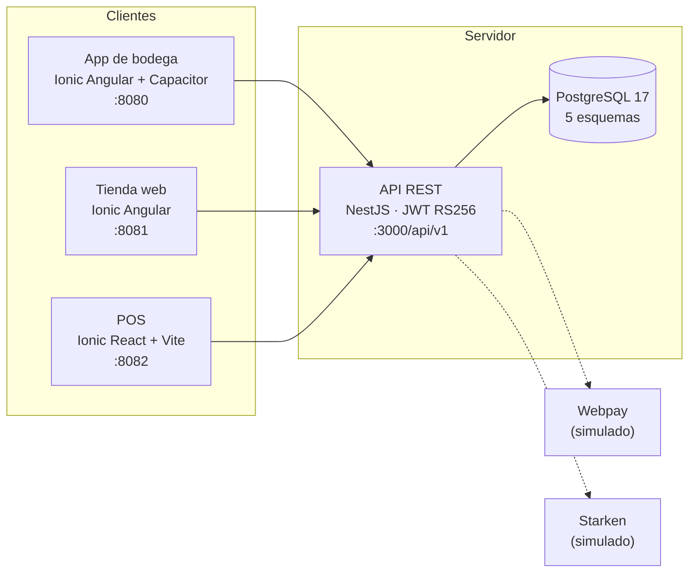

# Rockstar — Plataforma omnicanal de inventario y ventas

Proyecto de título (Capstone) para **Rockstar Store**, una tienda de ropa y merchandising de bandas de rock. La tienda controlaba su inventario en carpetas de papel: no sabía cuánto stock tenía en tiempo real, vendía productos que ya no existían y no registraba mermas.

Rockstar reemplaza ese control con **un inventario único** que comparten tres aplicaciones:

- **App de bodega** (Android y web): ingreso de mercadería, escaneo de QR, traspasos entre bodega y sala, conteos, mermas y preparación de despachos.
- **Tienda web**: catálogo con stock en tiempo real, carrito, pago con Webpay (simulado) y seguimiento del pedido.
- **POS (punto de venta)**: venta en el mostrador con efectivo o tarjeta, descuento inmediato del stock y boleta interna.

Las tres hablan con un mismo backend y una misma base de datos. Una prenda vendida en la tienda física deja de estar disponible en la web en el mismo instante.


---

## Contenido

- [Demostración](#demostración)
- [Métricas](#métricas)
- [Arquitectura](#arquitectura)
- [Tecnologías](#tecnologías)
- [Instalación](#instalación)
- [Uso](#uso)
- [Pruebas](#pruebas)
- [Estructura del repositorio](#estructura-del-repositorio)
- [Contribuir](#contribuir)

---

## Demostración

Capturas tomadas del sistema corriendo en Docker con los datos de demostración.

### Tienda web



### Punto de venta (POS)

| Catálogo y carrito | Boleta de la venta |
|---|---|
|  |  |



### App de bodega

| Inicio de sesión | Pantalla principal |
|---|---|
|  |  |

---

## Métricas

### El problema que resuelve

Cifras del diagnóstico de la tienda, en la propuesta del proyecto (`openspec/changes/plataforma-omnicanal-mvp/proposal.md`):

| Indicador | Valor |
|---|---|
| Ingresos perdidos por ventas de productos inexistentes | ~22 % |
| Fuga de inventario sin registrar | ~18 % |
| Decisiones tomadas sin datos confiables | ~35 % |
| Plazo del MVP | 12 semanas, en 4 sprints de 3 semanas |

### El sistema

Medido sobre el código de `Fase 2/Proyectos` el 5 de octubre de 2026.

| Componente | Líneas de código¹ | Detalle |
|---|---:|---|
| Backend (NestJS) | 3.354 | 41 endpoints REST en 7 controladores |
| Pruebas del backend | 2.118 | contrato de la API contra PostgreSQL en memoria |
| Contratos compartidos | 489 | tipos TypeScript entre backend y clientes |
| App de bodega (Ionic Angular) | 9.369 | 13 pantallas; incluye sus pruebas |
| Tienda web (Ionic Angular) | 4.105 | 10 páginas |
| POS (Ionic React) | 2.848 | incluye pruebas unitarias |
| Pruebas end-to-end del POS (Cypress) | 806 | 7 escenarios de uso |
| Base de datos (SQL) | 550 | 10 migraciones |
| **Total** | **23.639** | |

¹ Líneas no vacías de TypeScript, HTML, SCSS, CSS, SQL y JavaScript. Sin dependencias ni archivos generados.

| Base de datos | |
|---|---:|
| Esquemas (uno por dominio: usuarios, inventario, ventas, pagos, logística) | 5 |
| Tablas | 36 |
| Migraciones | 10 |
| Roles de usuario | 5 |
| Regiones y comunas de Chile cargadas | 16 y 346 |
| Fotos de bandas en el catálogo de semillas | 17 |

| Despliegue | |
|---|---:|
| Contenedores Docker | 5 (base de datos, API, app de bodega, tienda, POS) |
| Comando para levantar todo | 2 (`docker compose up` en cada proyecto) |

### Calidad

Resultado de la última ejecución, el 5 de octubre de 2026. **Pasan las 448 pruebas.**

| Suite | Herramienta | Pruebas | Resultado |
|---|---|---:|---|
| Backend, unitarias | Vitest | 11 | ✅ 11/11 |
| Backend, contrato de la API (end-to-end) | Vitest + PGlite | 146 | ✅ 146/146 |
| App de bodega | Vitest (Angular) | 251 | ✅ 251/251 |
| POS, unitarias | Vitest | 14 | ✅ 14/14 |
| POS, end-to-end en navegador | Cypress | 26 | ✅ 26/26 |
| **Total** | | **448** | ✅ |

La tienda web todavía no tiene pruebas automatizadas propias. Su flujo de compra lo cubren las pruebas de contrato del backend (`services/api/test/tienda.e2e.spec.ts`).

---

## Arquitectura



- **Un solo inventario.** Toda operación que cambia stock (venta, reserva, traspaso, merma) corre en una transacción que bloquea las filas de existencias. Dos canales nunca venden la misma unidad.
- **Idempotencia.** Ventas, compras y movimientos llevan una clave única. Reenviar una operación por una falla de red no la duplica.
- **Roles.** Cliente, Vendedor, Bodega, Gerente y RRHH. Cada uno ve y hace solo lo suyo.
- **Pagos y despachos simulados.** Están detrás de adaptadores (`pasarela.ts` y `transportista.ts`) que se reemplazan cuando la tienda tenga credenciales de Transbank y Starken.

---

## Tecnologías

| Capa | Tecnologías |
|---|---|
| Backend | Node.js, NestJS 12, TypeScript, JWT RS256, Argon2 |
| Base de datos | PostgreSQL 17 (PGlite en memoria para pruebas y desarrollo) |
| App de bodega | Ionic 9, Angular 22, Capacitor 8 (APK para Android), lector de QR |
| Tienda web | Ionic 8, Angular 18 |
| POS | Ionic React 9, React 19, Vite 8 |
| Pruebas | Vitest, Cypress, PGlite |
| Infraestructura | Docker, Docker Compose, nginx |
| Metodología | OpenSpec (especificación antes del código), Scrum en sprints de 3 semanas |

---

## Instalación

### Requisitos

- [Git](https://git-scm.com/)
- [Docker Desktop](https://www.docker.com/products/docker-desktop/) en ejecución
- Opcional, solo para trabajar sin Docker o correr pruebas: [Node.js](https://nodejs.org/) 22 o superior

### 1. Clonar el repositorio

```bash
git clone https://github.com/elsktr/CAPSTONE-PROYECTO-TITULO.git
cd CAPSTONE-PROYECTO-TITULO/"Fase 2/Proyectos"
```

### 2. Configurar el entorno

```bash
cd App-mobile-docker-backend
cp .env.example .env
```

Los valores por defecto sirven para desarrollo. Revisa `.env` si en tu equipo ocurre alguno de estos casos:

| Situación | Qué cambiar en `.env` |
|---|---|
| Ya tienes PostgreSQL instalado (puerto 5432 ocupado) | `DB_PUERTO=5433` |
| Windows reserva los puertos 8080–8082 (pasa con Hyper-V; se revisa con `netsh interface ipv4 show excludedportrange protocol=tcp`) | `APP_PUERTO=8180` y `TIENDA_PUERTO=8181` |

### 3. Levantar el backend, la bodega y la tienda

```bash
docker compose up --build -d
```

Al arrancar por primera vez, la API crea las tablas y carga los datos de demostración. La primera construcción tarda varios minutos.

### 4. Levantar el POS

El POS se une a la red Docker del paso anterior, así que va después:

```bash
cd ../PosRockStarStore
docker compose up --build -d
```

Si el puerto 8082 está reservado, crea un `.env` con `POS_PUERTO=8182`.

### 5. Comprobar

```bash
docker ps --format "{{.Names}}  {{.Status}}"
curl http://localhost:3000/api/v1/salud     # responde {"estado":"ok"}
```

Los cinco contenedores deben aparecer como `healthy`.

---

## Uso

| Aplicación | Dirección | Cuenta de prueba |
|---|---|---|
| Tienda web | http://localhost:8081 | `cliente@rockstar.cl` / `cliente123`, o "Continuar como invitado" |
| POS | http://localhost:8082 | `vendedor@rockstar.cl` / `vendedor123` |
| App de bodega | http://localhost:8080 | `bodega@rockstar.cl` / `bodega123` |
| Administración de la tienda (precios) | http://localhost:8081 → "Acceso administrador" | `gerente@rockstar.cl` / `gerente123` |
| API | http://localhost:3000/api/v1 | |

Las contraseñas de demostración son públicas. Fuera de desarrollo, usa `SEMBRAR_DEMO=false`.

### Una venta de punta a punta

1. En el **POS**, agrega una prenda al carrito, pulsa **Cobrar**, identifica al cliente y elige el medio de pago.
2. Si la sala de ventas no tiene la prenda, el POS ofrece **retirarla de bodega**.
3. Se emite la boleta y el stock baja en ese momento.
4. Abre la **tienda web** o la **app de bodega**: la misma prenda ya muestra el stock descontado.

### Comandos útiles

```bash
docker compose logs -f api          # registro del backend
docker compose down                 # detiene y conserva los datos
docker compose down --volumes       # detiene y borra la base (vuelve a los datos de demostración)

cd services/api && npm run semilla:bandas   # carga 17 bandas y 19 productos de muestra
cd apps/bodega-mobile && npm run apk        # genera el APK de Android
```

### Sin Docker

Con Node.js 22 y `npm install` en `App-mobile-docker-backend`:

```bash
cd services/api
npm run local        # API en http://localhost:3000 con PostgreSQL en memoria
```

---

## Pruebas

```bash
# Backend (desde App-mobile-docker-backend/services/api)
npm test                  # unitarias
npm run test:e2e          # contrato de la API, con base en memoria

# App de bodega (desde apps/bodega-mobile)
npm test -- --watch=false

# POS (desde PosRockStarStore)
npm run test.unit -- --run
npm run test.e2e          # Cypress; requiere el POS corriendo
```

Si el POS no usa el puerto 8082, indícalo a Cypress con `CYPRESS_BASE_URL=http://localhost:8182 npm run test.e2e`.

---

## Estructura del repositorio

```
CAPSTONE-PROYECTO-TITULO/
├── Fase 1/                         Planificación y evidencias
├── Fase 2/
│   ├── Evidencias Grupales/
│   ├── Evidencias Individuales/
│   ├── Evidencias Proyecto/
│   └── Proyectos/
│       ├── App-mobile-docker-backend/
│       │   ├── apps/bodega-mobile/      App de bodega (Ionic Angular + Capacitor)
│       │   ├── apps/e-commerce/         Tienda web (Ionic Angular)
│       │   ├── services/api/            Backend (NestJS)
│       │   ├── packages/contracts/      Tipos compartidos de la API
│       │   ├── db/migrations/           Esquema de PostgreSQL
│       │   └── openspec/                Especificaciones y plan de trabajo
│       └── PosRockStarStore/            Punto de venta (Ionic React)
├── Fase 3/
└── docs/capturas/                  Imágenes de este README
```

Cada proyecto tiene su propio README con el detalle técnico.

---

## Contribuir

1. **Crea una rama** desde `main` con un nombre descriptivo, por ejemplo `pos/descuentos` o `bodega/fix-escaner`. No subas cambios directo a `main`.
2. **Propón antes de programar.** Para un cambio de comportamiento, escribe la propuesta con OpenSpec (`/opsx:propose`) en el `openspec/` del proyecto. Así el equipo revisa el qué y el porqué antes del código.
3. **Mantén el estilo del código existente.** Nombres y comentarios en español, TypeScript estricto y sin `any` nuevos.
4. **Acompaña cada cambio con pruebas** y verifica que todas las suites de [Pruebas](#pruebas) pasen antes de abrir el Pull Request.
5. **Nunca subas secretos.** Los `.env`, claves y tokens quedan fuera del repositorio; solo se versionan los `.env.example`.
6. **Escribe commits en español** que expliquen qué cambia y por qué, por ejemplo `POS: ofrecer retiro desde bodega cuando la sala no alcanza`.
7. **Abre un Pull Request** con la descripción del cambio y cómo probarlo. Al menos otro integrante del equipo lo revisa antes de unirlo a `main`.
